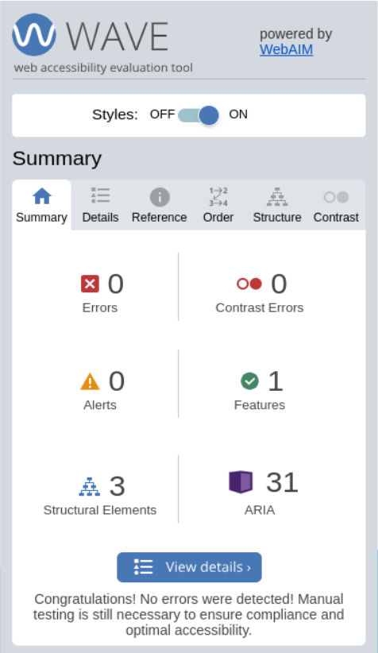
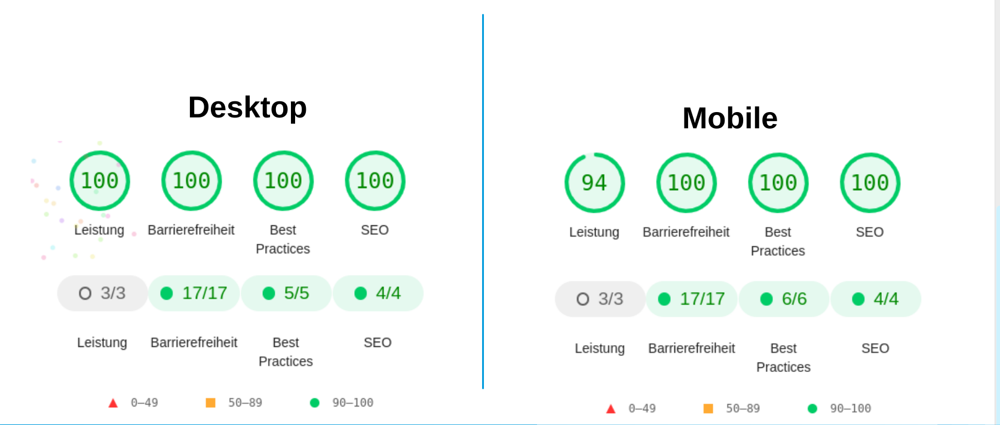

### Article Viewer Component

Written in plain HTML/CSS and JS.

- Fully responsive
- Performant DOM updates with fragments
- Dynamic ARIA-attribute handling
- Smart UI with debouncers to deliver fantastic UX

#### Getting started

Serve this project via a webserver or if you have docker compose installed run 

`docker compose build && docker compose up -d`

to serve this project via http://localhost:8080

### Reports

